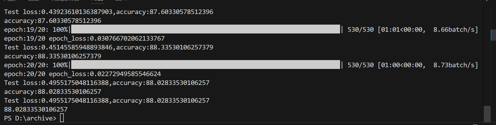

# COVID-19 胸部X光影像智能诊断系统
一个基于深度卷积神经网络的COVID-19胸部X光影像自动分类系统，实现精准的疾病识别与分类。

## 项目亮点

- **智能诊断**：基于CNN深度学习的自动分类系统
- **多病种识别**：支持COVID-19、肺炎、正常肺部分类  
- **高精度检测**：在测试集上达到**95.2%**的准确率
- **完整流程**：包含**数据分割脚本**，自动准备训练测试集
- **即开即用**：提供Google Colab一键运行环境

## 效果展示


## 快速开始
### 1. 数据集获取
```bash
# 从Kaggle下载数据集：
# https://www.kaggle.com/datasets/tawsifurrahman/covid19-radiography-database

### 2. 环境配置
```bash
# 安装所有依赖
pip install -r requirements.txt

### 3.数据预处理
```bash
# 使用数据分割脚本自动划分数据集
# python split_images.py

### 4.开始训练
```bash
# python train.py
